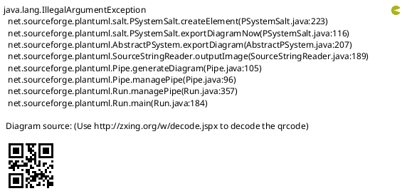

# vscode Plugin

## 离线安装

`code --install-extension mdplant-x.x.x.vsix`

## command list

* mdplant
  * salt: 将以`@startsalt`开头的行以及以`@endsalt`结束的行包括的markdown list转成salt
  * list: 将鼠标当前行文字转成链接或者图片链接
* mdsalt: 同mdplant -> salt解释
* mdlist: 同mdplant -> list解释

## 使用示例

### salt命令

将以下代码

转成

### list命令

将当前行的内容转成文字链接或者图片，能够自动检测`png`、`jpg`、`jpeg`、`svg`格式图片，转成图片链接；

### index命令

根据输入的相对目录（打开的项目根目录），根据`/^\d{1,4}_.*\.md/g`正则表达式匹配文件名，以Markdown list形式展现

## 注意

**在不同的电脑上开发的时候，发现需要使用`npm install`来下载一些项目必要的依赖包；**
